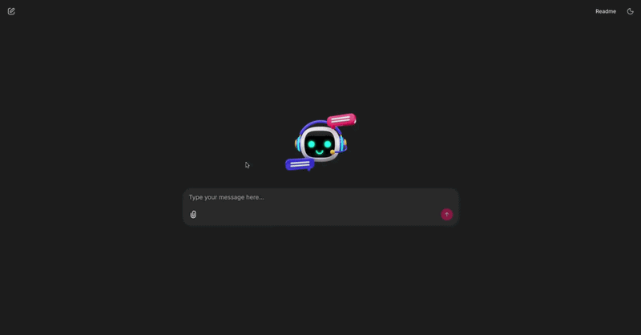

# System Agent

A lightweight multi‑agent chat orchestrator built on **LangGraph** and **LangChain**, with a pluggable UI layer (currently Chainlit). It routes user queries through a supervisor to specialized agents and streams model output back to the UI.

## Demo


## Highlights
- Multi‑agent orchestration using LangGraph (`multi_agents/graph.py`).
- Supervisor‑driven routing to specialist agents (`multi_agents/agents/supervisor.py`).
- Pluggable UI layer with a clean callback interface (`ui/base.py`).
- Streaming bridge to propagate model output to the UI (`app/bridge.py`).
- Provider abstraction for OpenAI, HuggingFace, and Gemini models (`models/`).

## Repository Layout
- `main.py` — Entry point to launch a UI (Chainlit now, Streamlit placeholder).
- `app/controller.py` — Wires UI callbacks to the multi‑agent graph.
- `app/bridge.py` — Singleton to stream tokens/events to UI.
- `ui/base.py` — Base UI contract + message handler registration.
- `ui/chainlit_adapter.py` — Chainlit adapter implementation.
- `multi_agents/` — Multi‑agent graph and agent implementations.
- `models/` — LLM provider wrappers (OpenAI, HuggingFace, Gemini).
- `configuration/` — Config loader and static config.
- `.chainlit/` — Chainlit configuration.

## Setup
### 1) Python
This repo targets Python **3.11** (see `.python-version`).

### 2) Install dependencies
```bash
python -m venv .venv
source .venv/bin/activate
pip install -r requirements.txt
```

### 3) Environment variables
`configuration/config_loader.py` loads `.env` if present. Typical keys:
- `OPENAI_API_KEY`
- `HUGGING_FACE_API_KEY`
- `GEMINI_API_KEY`

## Run (Chainlit)
```bash
python main.py --ui chainlit
```
This launches Chainlit with `ui/chainlit_adapter.py`.

## How It Works
1. The UI (Chainlit) receives a user message and dispatches it via `ui/base.py`.
2. `app/controller.py` forwards the query to `multi_agents/graph.py`.
3. The **Supervisor** picks the best agent based on declared functionality.
4. Agents call tools (if any) and return results.
5. Output is streamed back to the UI via `app/bridge.py`.

## Adding a New Agent
1. Create a new agent class in `multi_agents/agents/` that extends `multi_agents/agents/base.py`.
2. Implement `get_llm`, `get_system_message`, `get_agent_name`, `get_tool_name`, `get_functionality`, and `get_applicable_tools`.
3. Add the agent instance to `multi_agents/agents/__init__.py` in `agents_list`.

## Notes
- Chainlit behavior and UI settings live in `.chainlit/config.toml`.
- The current directory agent is a template for tool‑based actions.

